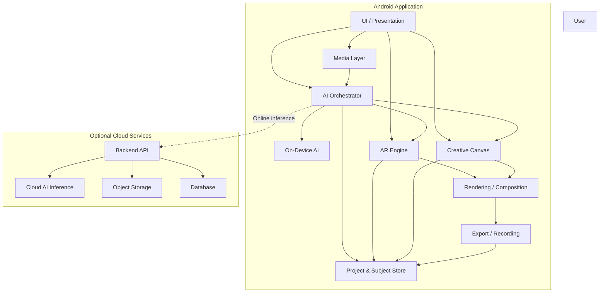
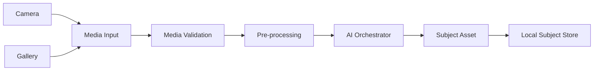
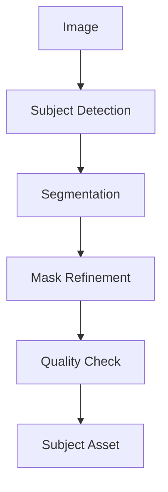
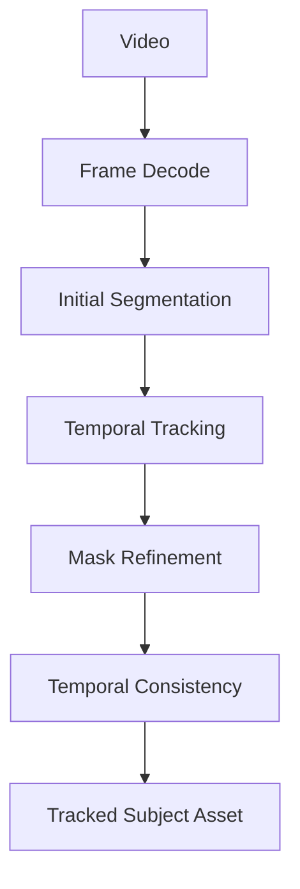
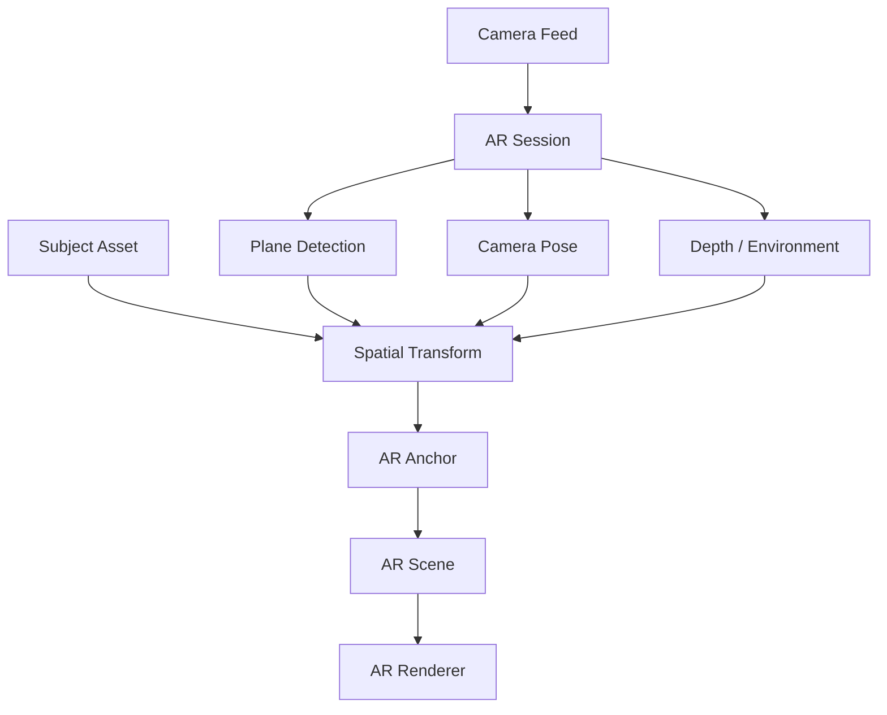
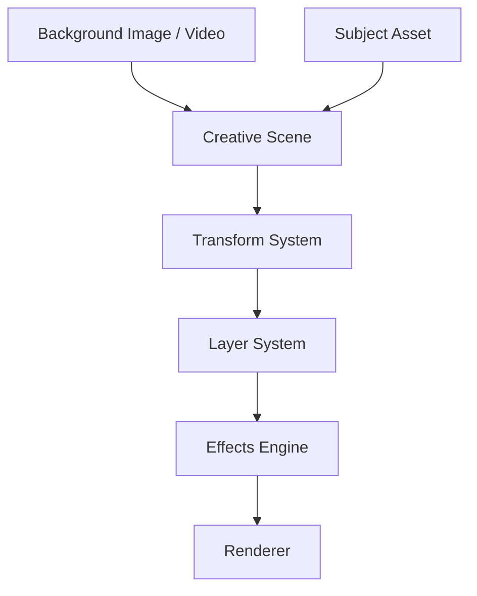
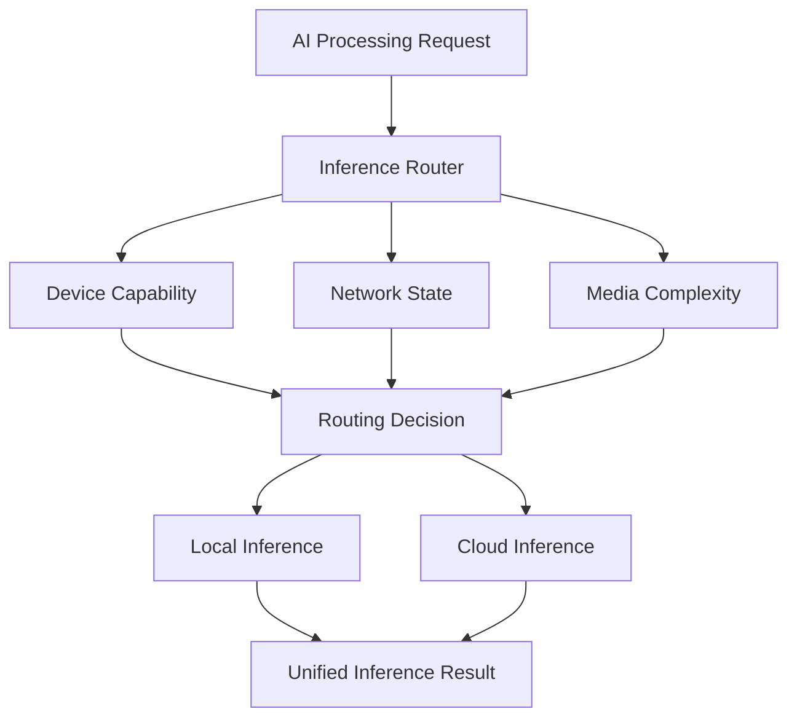
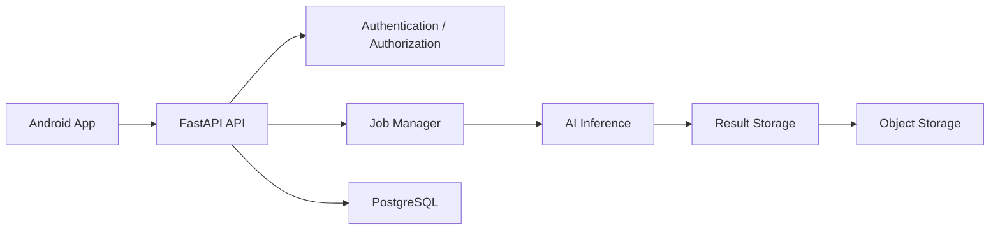

# RE:PLACE — System Architecture

## 1. Architecture Objective

RE:PLACE is designed as a modular Android-first system with four major responsibilities:

1. **Media understanding** — capture/import and AI subject extraction.
2. **Spatial composition** — AR placement and tracking.
3. **Creative composition** — 2D image/video editing and effects.
4. **Media output** — rendering, recording, export, and local persistence.

The architecture must support both **offline/on-device inference** and **online/cloud inference** without coupling the UI to a specific AI implementation.

---

# 2. High-Level Architecture



---

# 3. Architectural Principles

## 3.1 Separation of Concerns

The following responsibilities must remain separate:

```text
UI
 ↓
Domain / Use Cases
 ↓
Engine Interfaces
 ↓
Implementations
 ↓
Infrastructure
```

UI components must not directly:

* execute AI models,
* call cloud APIs,
* manipulate databases,
* perform video processing,
* contain AR business logic.

---

## 3.2 AI Model Independence

The application must not depend directly on one specific segmentation model.

Instead:

```text
AI Interface
     │
     ├── Local Implementation
     │
     ├── Cloud Implementation
     │
     └── Future Implementation
```

This allows models to be replaced without redesigning the application.

---

## 3.3 Offline/Online Independence

The rest of the application should interact with an abstract inference interface.

```text
                InferenceRequest
                       ↓
               InferenceRouter
                 /           \
                /             \
        LocalInference    CloudInference
                \             /
                 \           /
                  ↓         ↓
                 InferenceResult
```

The UI should not know which implementation processed the request.

---

# 4. Core Architectural Layers

## Layer 1 — Presentation

Responsible for:

* screens
* navigation
* gestures
* UI state
* user interaction
* loading/error states

Does not contain AI or infrastructure logic.

---

## Layer 2 — Domain

Contains application behavior and use cases.

Examples:

```text
CreateSubject
SaveSubject
LoadSubject
CreateARScene
PlaceSubject
CreateCanvasScene
RenderComposition
ExportCreation
ProcessMedia
```

The domain layer should remain independent of Android-specific infrastructure wherever practical.

---

## Layer 3 — AI Engine

Responsible for:

* media analysis
* segmentation
* mask generation
* mask refinement
* tracking
* inference routing
* AI quality information

Core abstraction:

```text
InferenceEngine
```

Implementations:

```text
LocalInferenceEngine
CloudInferenceEngine
```

---

## Layer 4 — AR Engine

Responsible for:

* camera pose
* plane detection
* anchors
* spatial transforms
* depth
* tracking
* AR rendering integration

The AR engine consumes `SubjectAsset` objects rather than raw media.

---

## Layer 5 — Creative Engine

Responsible for:

* canvas composition
* layers
* transformations
* effects
* animations
* background media
* scene state

The creative engine should use the same subject assets as AR.

---

## Layer 6 — Rendering / Media Engine

Responsible for:

* image composition
* video composition
* frame processing
* recording
* encoding
* export

This layer should be independent from the UI.

---

## Layer 7 — Data Layer

Responsible for:

* subjects
* projects
* local media
* metadata
* settings
* processing history

Cloud persistence is optional and should not be required for core functionality.

---

# 5. Media Pipeline



### Responsibilities

**Media Input**

Receives image/video content.

**Validation**

Checks:

* file type
* resolution
* duration
* size
* device compatibility

**Pre-processing**

Prepares media for inference.

Examples:

* resizing
* frame sampling
* format conversion

---

# 6. AI Pipeline

## Image



## Video



Video processing is intentionally separated from image processing because temporal consistency is a major system risk.

---

# 7. Subject Asset

The `SubjectAsset` is the central object shared by the AR and Creative systems.

Conceptually:

```text
SubjectAsset
│
├── identity
├── sourceMedia
├── mask
├── transparency
├── boundingBox
├── dimensions
├── quality
├── processingMode
└── trackingData
```

For video subjects:

```text
SubjectAsset
└── FrameSequence
    ├── Frame 001
    ├── Frame 002
    ├── Frame 003
    └── ...
```

The exact storage representation is defined separately in the data model.

---

# 8. AR Architecture



### AR operations

The AR system must support:

* placement
* translation
* scaling
* rotation
* anchoring
* tracking
* scene updates
* removal
* duplication

---

# 9. Creative Canvas Architecture



A creative scene consists of:

```text
Scene
│
├── Background
│
├── Layers
│   ├── Subject
│   ├── Subject
│   ├── Text
│   └── Effect
│
└── Scene Settings
```

---

# 10. Shared Scene Model

AR and Canvas should share common concepts wherever possible.

```text
Scene
│
├── Objects
│
├── Transform
│
├── Visibility
│
└── Metadata
```

The difference is the environment:

```text
AR Scene
→ physical camera environment

Creative Scene
→ 2D/2.5D media environment
```

This prevents the project from developing two completely unrelated composition systems.

---

# 11. Rendering Pipeline


Rendering must be performed away from the main UI thread.

Long-running rendering should expose:

```text
Progress
Status
Error
Cancellation
Completion
```

---

# 12. Recording Architecture

For AR:

```text
Camera Frame
     +
AR Render
     +
Effects
     ↓
Composition
     ↓
Video Encoder
     ↓
Device File
```

For Canvas:

```text
Background Video
      +
Scene Layers
      +
Effects
      ↓
Composition
      ↓
Video Encoder
      ↓
Device File
```

The final recording pipeline should not depend on the UI rendering tree.

---

# 13. Offline/Online Architecture



### Local processing

Used when:

* network unavailable
* task is lightweight
* device can handle processing
* low latency is preferred

### Cloud processing

Used when:

* processing is computationally expensive
* higher quality is required
* local resources are insufficient
* network conditions are acceptable

---

# 14. Backend Architecture

The backend exists primarily to support optional cloud inference.



The backend should remain stateless where possible.

Long-running inference jobs should be represented as jobs rather than blocking HTTP requests.

---

# 15. Data Flow

## Image Creation

```text
Image
 ↓
AI Processing
 ↓
SubjectAsset
 ↓
Save Subject
 ↓
Create Scene
 ↓
Place Subject
 ↓
Render
 ↓
Export
```

## AR Creation

```text
Camera
 ↓
AR Session
 ↓
Environment Understanding
 ↓
SubjectAsset
 ↓
Anchor
 ↓
AR Scene
 ↓
Recording
 ↓
Export
```

## Video Creation

```text
Video
 ↓
Frame Processing
 ↓
Segmentation
 ↓
Tracking
 ↓
SubjectAsset
 ↓
Creative / AR Scene
 ↓
Composition
 ↓
Encoding
 ↓
Export
```

---

# 16. Storage Architecture

The application should follow local-first principles.

```text
Local Storage
│
├── Subjects
├── Projects
├── Media
├── Rendered Outputs
└── Application Settings
```

Cloud storage is optional.

Cloud data should never become a hard dependency for opening or editing locally stored projects unless a future feature explicitly requires it.

---

# 17. Module Boundaries

Recommended high-level Android modules:

```text
app
│
├── core
│   ├── media
│   ├── ai
│   ├── ar
│   ├── rendering
│   ├── storage
│   └── network
│
├── domain
│   ├── model
│   └── usecase
│
└── feature
    ├── home
    ├── capture
    ├── subjects
    ├── ar
    ├── editor
    ├── projects
    └── export
```

The exact Gradle module structure can evolve during implementation, but responsibility boundaries should remain clear.

---

# 18. Error Handling

Every major processing pipeline must have explicit failure states.

Examples:

```text
MEDIA_INVALID
MEDIA_UNSUPPORTED
SEGMENTATION_FAILED
TRACKING_FAILED
INFERENCE_TIMEOUT
NETWORK_UNAVAILABLE
CLOUD_PROCESSING_FAILED
AR_UNSUPPORTED
RENDER_FAILED
EXPORT_FAILED
STORAGE_FAILED
```

Errors should be translated into user-friendly messages at the presentation layer.

Technical exceptions must not be displayed directly to users.

---

# 19. Performance Principles

The application should:

* avoid processing unnecessary frames
* resize media before expensive inference where appropriate
* perform heavy work off the main thread
* release large bitmaps promptly
* avoid loading entire large videos into memory
* use streaming/chunked processing where appropriate
* cache reusable AI results
* avoid repeating identical inference
* monitor processing latency

---

# 20. Security and Privacy Boundaries

User media is sensitive application data.

Rules:

* Keep media local whenever possible.
* Upload only when cloud processing is required.
* Use secure transport for cloud communication.
* Never hard-code secrets in the Android application.
* Do not log raw user media.
* Do not log sensitive media metadata unnecessarily.
* Delete temporary cloud media according to the application's retention policy.

---

# 21. Riskiest Components

### Risk 1 — Video Segmentation + Tracking

Challenge:

```text
Frame 1 → Mask
Frame 2 → Mask
Frame 3 → Mask
...
```

The subject must remain temporally stable.

---

### Risk 2 — Realistic AR Compositing

Challenge:

The subject must appear to belong to the environment rather than simply floating over the camera image.

Important areas:

* depth
* occlusion
* lighting
* scale
* tracking
* anchoring

---

### Risk 3 — Mobile Performance

AI + AR + video processing can heavily consume:

* CPU
* GPU
* RAM
* battery

Performance must therefore be treated as an architectural concern from the beginning.

---

# 22. Architectural Success Criteria

The architecture is successful when:

1. AI models can be replaced without redesigning the UI.
2. Local and cloud inference share a common interface.
3. The same `SubjectAsset` can be used by AR and Canvas.
4. Video processing does not block the UI.
5. Core functionality works without an account.
6. Core functionality remains usable offline where supported.
7. Rendering/export is independent from presentation logic.
8. New effects can be added without modifying unrelated systems.
9. Cloud services remain optional for the core experience.
10. The application can evolve from MVP to production without a complete rewrite.

---

# 23. Architectural North Star

```text
                 USER
                   │
                   ▼
             PRESENTATION
                   │
                   ▼
                DOMAIN
                   │
        ┌──────────┼──────────┐
        ▼          ▼          ▼
       AI          AR       CREATIVE
        │          │          │
        └──────────┼──────────┘
                   ▼
               RENDERING
                   │
                   ▼
                EXPORT
                   │
                   ▼
             LOCAL DEVICE

                   +
             OPTIONAL CLOUD
```

> **Keep the product experience simple while keeping the underlying system modular, replaceable, measurable, and production-ready.**
